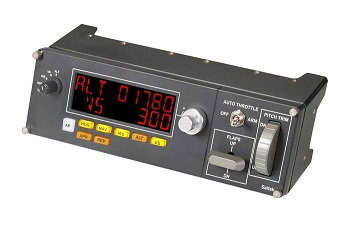
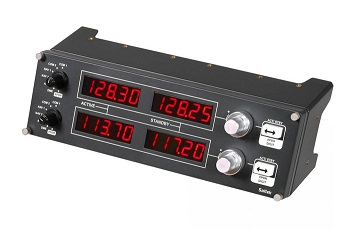
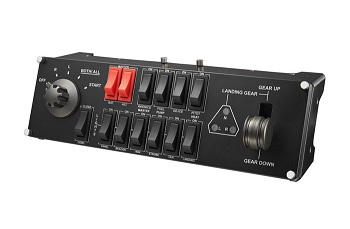
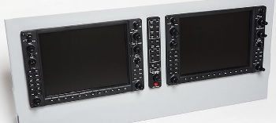
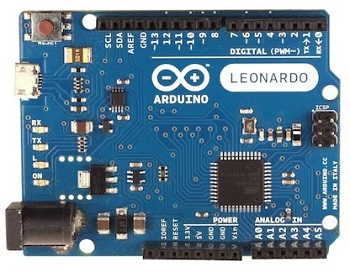

<p align="center">
  <picture>
    <source media="(prefers-color-scheme: light)" srcset="https://github.com/norberttak/XPanel/raw/master/doc/xpanel.svg">
    <source media="(prefers-color-scheme: dark)" srcset="https://github.com/norberttak/XPanel/raw/master/doc/xpanel-dark.svg">
    
  </picture>
</p>

**Detailed description and configuration options can be found [here](doc/documentation.md)**

XPanel is a plugin for [X-Plane](https://www.x-plane.com/) >=11 flight simulator. If you have or plan to build a home cockpit then it is good to check this. It can connect your USB HID hardware devices to the X-Plane system.

It has a configuration file where you can define the logical connections between hardware elements (buttons, switches, displays, etc) and the internal [datarefs and commands](https://developer.x-plane.com/sdk/) of X-Plane.

Currently, it supports these types of USB-HID devices:

| Device                                              | URL                                                                                               | Description                                                                                |
|-----------------------------------------------------|---------------------------------------------------------------------------------------------------|--------------------------------------------------------------------------------------------|
|                | [Saitek Multi Panel](https://www.saitek.com/uk/prod-bak/multi.html)                               | This is a device that mainly contains the buttons associated with the autopilot functions  |
|                | [Saitek Radio Panel](https://www.saitek.com/uk/prod-bak/radio.html)                               | Device to control radio functions of your airplane                                         |
|              | [Saitek Switch Panel](https://www.saitek.com/uk/prod-bak/switch.html)                             | Device with switches to control the electrical systems of your plane                       |
|           | [Logitech/Saitek Flight Instrument Panel](https://www.saitek.com/uk/prod-bak/fip.html)            | Device with a graphical screen to display aircraft instruments (supported only on Windows) |
|                           | [TRC-1000 PFD/MFD & Audio Panel](https://www.simkits.com/product/trc1000-complete-glass-cockpit/) | These devices are replica of Garmin G1000 cockpit panels                                   |
|  | Custom USB HID Devices                                                                            | You can use a custom USB HID device like Arduino Leonardo board                            |

# Install
## Windows
Get the latest release from [github](https://github.com/norberttak/XPanel/releases)

Copy the xpanel folder into your X-Plane plugin directory (in my case it is c:\XPlane12\resources\plugins).

Please don't forget to remove any other plugins that want to connect to your USB Hid devices in the home cockpit.

The aircraft-specific configuration file (xpanel.ini) shall be put into the aircraft folder.

If you have any errors during the plugin load or run please check the main X-Plane log file. If you want more detailed logs from the plugin, please set the log level to DEBUG or even TRACE. See the details at [troubleshooting](#trouble-shooting)

## Linux
Get the latest release from [github](https://github.com/norberttak/XPanel/releases)
Copy the xpanel folder into your X-Plane plugin directory.

### udev rules
You need to add the appropriate udev rules to grant access permissions for the devices

For the Saitek devices you need to set udev rules like this:
```
/etc/udev/rules.d/99-saitek.rules

KERNEL=="hidraw*", ATTRS{idProduct}=="0d67", ATTRS{idVendor}=="06a3", MODE="0666", SYMLINK+="saitekswitchpanel"
KERNEL=="hidraw*", ATTRS{idProduct}=="0d05", ATTRS{idVendor}=="06a3", MODE="0666", SYMLINK+="saitekradiopanel"
KERNEL=="hidraw*", ATTRS{idProduct}=="0d06", ATTRS{idVendor}=="06a3", MODE="0666", SYMLINK+="saitekmultipanel"
BUS=="usb", ATTRS{idProduct}=="0d05", ATTRS{idVendor}=="06a3", MODE="0666"
BUS=="usb", ATTRS{idProduct}=="0d06", ATTRS{idVendor}=="06a3", MODE="0666"
BUS=="usb", ATTRS{idProduct}=="0d67", ATTRS{idVendor}=="06a3", MODE="0666"
```

If you have an Arduino based board, please add this rule:
```
/etc/udev/rules.d/99-leonardo.rules:

KERNEL=="hidraw*", ATTRS{idVendor}=="2341", ATTRS{idProduct}=="8036", MODE:="0666", SYMLINK+="arduinoleonardo"
BUS=="usb", ATTRS{idVendor}=="2341", ATTRS{idProduct}=="8036", MODE="0666"
```

After setting the above rules, please don't forget to reload them


```
udevadm control --reload
```

# Build
## Windows
Check out the latest source file from [github](https://github.com/norberttak/XPanel)

Open the solution file (XPanel.sln) with Visual Studio. Select either Release or Debug build configuration. The solution file contains two projects. One for the xpanel plugin and one for the unit tests.

The build artifact of the plugin is generated in the Release|Debug/plugin/xpanel folder (win.xpl file)

You can also use `cmake` to build the plugin on Windows

#### Run unit tests
To run the unit tests, open the Visual Studio test menu and select Test Explorer. Push the run-all button and check the test results.

## Linux
Check out the latest source file from [github](https://github.com/norberttak/XPanel)

Dependencies:
- C++ toolchain
- CMake
- pkg-config
- libudev
- Lua

```
$ cmake --install-prefix /tmp/xpanel-install -S . -B build
$ cmake --build build
$ cmake --install build
```

Copy or link the `/tmp/xpanel-install/XPanel` directory into the X-Plane plugin folder.

## Report bugs
If you find any bug in the plugin or need help please open a new bug report at [github](https://github.com/norberttak/XPanel/issues) Please always attach the X-Plane log file and make sure you set the highest log level (TRACE) in the plugin config file. Also attach your plugin configuration file as well.
