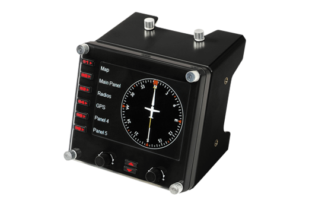
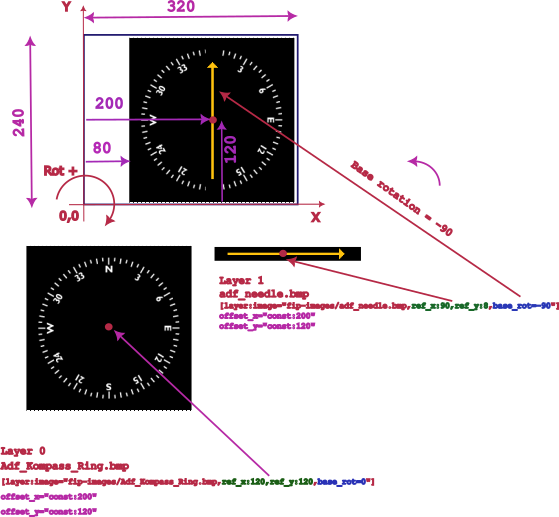

<p align="center">
  <picture>
    <source media="(prefers-color-scheme: light)" srcset="https://github.com/norberttak/XPanel/raw/master/doc/xpanel.svg">
    <source media="(prefers-color-scheme: dark)" srcset="https://github.com/norberttak/XPanel/raw/master/doc/xpanel-dark.svg">
    
  </picture>
</p>

XPanel is a plugin for [X-Plane](https://www.x-plane.com/) >=11 flight simulator. If you have or plan to build a home cockpit then it is good to check this. It can connect your USB HID hardware devices to the X-Plane system.

It has a configuration file where you can define the logical connections between hardware elements (buttons, switches, displays, etc) and the internal [datarefs and commands](https://developer.x-plane.com/sdk/) of X-Plane.

Currently, it supports these types of USB-HID devices:

| Device                                          | URL                                                                                               | Description                                                                                |
|-------------------------------------------------|---------------------------------------------------------------------------------------------------|--------------------------------------------------------------------------------------------|
|                | [Saitek Multi Panel](https://www.saitek.com/uk/prod-bak/multi.html)                               | This is a device that mainly contains the buttons associated with the autopilot functions  |
|                | [Saitek Radio Panel](https://www.saitek.com/uk/prod-bak/radio.html)                               | Device to control radio functions of your airplane                                         |
|              | [Saitek Switch Panel](https://www.saitek.com/uk/prod-bak/switch.html)                             | Device with switches to control the electrical systems of your plane                       |
|           | [Logitech/Saitek Flight Instrument Panel](https://www.saitek.com/uk/prod-bak/fip.html)            | Device with a graphical screen to display aircraft instruments (supported only on Windows) |
|                           | [TRC-1000 PFD/MFD & Audio Panel](https://www.simkits.com/product/trc1000-complete-glass-cockpit/) | These devices are replica of Garmin G1000 cockpit panels                                   |
|  | Custom USB HID Devices                                                                            | You can use a custom USB HID device like Arduino Leonardo board                            |

# Install
## Windows
Get the latest release from [github](https://github.com/norberttak/XPanel/releases)

Copy the xpanel folder into your X-Plane plugin directory (in my case it is c:\XPlane12\resources\plugins).

Please don't forget to remove any other plugins that want to connect to your USB Hid devices in the home cockpit.

The aircraft-specific configuration file (xpanel.ini) shall be put into the aircraft folder.

If you have any errors during the plugin load or run please check the main X-Plane log file. If you want more detailed logs from the plugin, please set the log level to DEBUG or even TRACE. See the details at [troubleshooting](#trouble-shooting)

## Linux
Get the latest release from [github](https://github.com/norberttak/XPanel/releases)
Copy the xpanel folder into your X-Plane plugin directory.

If you have an Arduino based board you need to add the appropriate udev rules to grant device access permissions, for example:
```
/etc/udev/rules.d/99-leonardo.rules:

SUBSYSTEMS=="usb", ATTRS{idVendor}=="2341", ATTRS{idProduct}=="8036", MODE:="0666"
```


# Build
## Windows
Check out the latest source file from [github](https://github.com/norberttak/XPanel)

Open the solution file (XPanel.sln) with Visual Studio. Select either Release or Debug build configuration. The solution file contains two projects. One for the xpanel plugin and one for the unit tests.

The build artifact of the plugin is generated in the Release|Debug/plugin/xpanel folder (win.xpl file)

You can also use `cmake` to build the plugin on Windows

#### Run unit tests
To run the unit tests, open the Visual Studio test menu and select Test Explorer. Push the run-all button and check the test results.

## Linux
Check out the latest source file from [github](https://github.com/norberttak/XPanel)

Dependencies
- C++ toolchain
- CMake
- pkg-config
- hidapi
- Lua

```
$ cmake --install-prefix /tmp/xpanel-install -S . -B build
$ cmake --build build
$ cmake --install build
```

Copy or link the `/tmp/xpanel-install/XPanel` directory into the X-Plane plugin folder.

# Configuration
## Config options general description
The configuration file format is _similar_ to the ini file format. It is divided into sections. A section can have properties. A section is marked by square brackets ([ ]). Every section shall have a unique id.
```ini
[button:id="NAV"]
```
The configuration file shall be named as **xpanel.ini** and need to put be into the folder of your aircraft.

### Comments
All characters after a semi-column (;) are considered comments.
```ini
on_push="commandref:/sim/cmd/HDG:begin";this is a comment
;this is a full line comment
```
### Log level
This plugin has a very simple log facility that can be used during debug sessions. The log level can be set from the configuration files:
```ini
log_level="TRACE|DEBUG|INFO|WARNING|ERROR"
```
Set the log level of the plugin. The log lines are written to X-Plane's default log file. In normal use-cases set the log_level to ERROR.
```ini
log_level="ERROR"
```
### Aircraft ACF file

The ACF file is the main file for an X-Plane aircraft. The plugin gets the ACF file name parameter from the X-Plane system. The reason to put the ACF file name into the configuration is only for safety. During parse, we can check if accidentally a wrong configuration file (created for another aircraft) has been loaded.
```ini
aircraft_acf="tu154.acf"
```
### Script file

You can write action handlers (see later) in LUA script as well. The plugin will load and interpret the script file you specify here. The script file shall be in the current aircraft's folder (the same directory as the xpanel.ini config file)
```ini
script_file="TU154-arduino-home-cockpit.lua"
```
The details of the LUA script files are in the [lua config description](lua.md) document.

## Devices
Devices can be defined by a new section in the configuration file. Currently, it supports these types of devices: XSaintek's Multi Panel and a homemade custom USB-HID IO board.
```ini
[device:id="saitek_multi"]
[device:id="saitek_radio"]
[device:id="saitek_switch"]
[device:id="saitek_fip_screen"]
[device:id="trc1000_pfd"]
[device:id="trc1000_audio"]
[device:id="aurduino_homecockpit"]
```
The devices have a few config options which can be set by the configuration file.
* USB VID (Vendor ID) in hexadecimal format
* USB PID (Product ID) in hexadecimal format

```ini
[device:id="aurduino_homecockpit"]
vid="2341"
pid="8036"
```

A device can have Buttons, Lights (LEDs), Displays, and Encoders.

### Custom USB-HID IO boards
If you have a USB HID capable IO board (like I have an Arduino Lenoardo) you
can define the logical (or symbolic) names for each register bits in a configuration file. A USB HID report is based on bytes so the config file follows this order as well.

To define a symbolic name you need to select the register (1 byte long registers with  0-based index) and then the bit index. In the example below we define two symbolic names (STROBE and DOME) which are in register 1 and assign to the 0 and the 1 bit respectively.

```ini
[register:adr=1]
button:id="STROBE",bit=0
button:id="DOME",bit=1

[register:adr=5]
display:id="ALTIMETER_GAUGE",width=2
```
In the aircraft-specific configuration files, you can use these symbolic names.

**Note**: The board-specific config file is not aircraft specific therefore you should have only one instance of this config and put it in the same folder where the plugin binary is installed (for example:
c:\xplane11\resources\plugins\XPanel\64\board-config.ini)

The release package contains my board-config.ini but for sure you have to modify it
according to your HW design.

## Buttons
An input device on the HW panel (button, switch, rotation switch) needs to be mapped as __button__ in the configuration file. Practically every bit mapped input device is handled as a button. Even if it is a rotary encoder but it is mapped to USB register bit value (like a Saitek panel's encoder).
Every button shall be defined as a new section and need to have a pre-defined id. The predefined IDs can be seen in the next table.

<style type="text/css">
.tg  {border-collapse:collapse;border-spacing:0;}
.tg td{border-color:black;border-style:solid;border-width:1px;font-family:Arial, sans-serif;font-size:12px;
  overflow:hidden;padding:10px 5px;word-break:normal;}
.tg th{border-color:black;border-style:solid;border-width:1px;font-family:Arial, sans-serif;font-size:12px;
  font-weight:normal;overflow:hidden;padding:10px 5px;word-break:normal;}
.tg .tg-j1i3{border-color:inherit;position:-webkit-sticky;position:sticky;text-align:left;top:-1px;vertical-align:top;
  will-change:transform}
.tg .tg-0pky{border-color:inherit;text-align:left;vertical-align:top}
</style>
<table class="tg">
<thead>
  <tr>
    <th class="tg-j1i3">Device</th>
    <th class="tg-j1i3">Button ID</th>
    <th class="tg-j1i3">Recommended Function</th>
  </tr>
</thead>
<tbody>
<tr>
<td  rowspan="21" bgcolor="#F3BBAF">Saitek Multi Panel</td>
<tr><td >AP</td> <td >Autopilot</td></tr>
<tr><td >HDG</td> <td >Heading mode</td></tr>
<tr><td >NAV</td> <td >Navigation mode</td></tr>
<tr><td >IAS</td> <td >Indicated Air Speed (IAS) hold mode</td></tr>
<tr><td >ALT</td> <td >Altitude hold mode</td></tr>
<tr><td >VS</td> <td >Vertical speed hold mode</td></tr>
<tr><td >APR</td> <td >Approach mode</td></tr>
<tr><td >REV</td> <td >Revers approach mode</td></tr>
<tr><td >AUTO_THROTTLE</td> <td >Auto throttle arm</td></tr>
<tr><td >FLAPS_UP</td> <td >Flaps up handle</td></tr>
<tr><td >FLAPS_DOWN</td> <td >Flaps down handle</td></tr>
<tr><td >TRIM_WHEEL_DOWN</td> <td >Trim wheel</td></tr>
<tr><td >TRIM_WHEEL_UP</td> <td >Trim wheel</td></tr>
<tr><td >KNOB_PLUS</td> <td >Multi function rotation knob, + direction</td></tr>
<tr><td >KNOB_MINUS</td> <td >Multi function rotation knob, - direction</td></tr>
<tr><td >SW_ALT</td> <td >Selector Switch, ALT position</td></tr>
<tr><td >SW_VS</td> <td >Selector Switch, VS position</td></tr>
<tr><td >SW_IAS</td> <td >Selector Switch, IAS position</td></tr>
<tr><td >SW_HDG</td> <td >Selector Switch, HDG position</td></tr>
<tr><td >SW_CRS</td> <td >Selector Switch, CRS position</td></tr>
<tr>
<td  rowspan="25" bgcolor="#E4F3AF">Saitek Radio Panel</td>
<tr><td >KNOB_UP_BIG_PLUS</td> <td >Upper Rotation Knob: Outer (big) Ring, Plus Direction</td></tr>
<tr><td >KNOB_UP_BIG_MINUS</td> <td >Upper Rotation Knob: Outer (big) Ring, Minus Direction</td></tr>
<tr><td >KNOB_UP_SMALL_PLUS</td> <td >Upper Rotation Knob: Iner (small) Button, Plus Direction</td></tr>
<tr><td >KNOB_UP_SMALL_MINUS</td> <td >Upper Rotation Knob: Iner (small) Button, Minus Direction</td></tr>
<tr><td >KNOB_DOWN_BIG_PLUS</td> <td >Down Rotation Knob: Outer (big) Ring, Plus Direction</td></tr>
<tr><td >KNOB_DOWN_BIG_MINUS</td> <td >Down Rotation Knob: Outer (big) Ring, Minus Direction</td></tr>
<tr><td >KNOB_DOWN_SMALL_PLUS</td> <td >Down Rotation Knob: Inner (small) Button, Plus Direction</td></tr>
<tr><td >KNOB_DOWN_SMALL_MINUS</td> <td >Upper Rotation Knob: Inner (small) Button, Minus Direction</td></tr>
<tr><td >ACT_STBY_UP</td> <td >Upper Xchange button (Active <--> Standby)</td></tr>
<tr><td >ACT_STBY_DOWN</td> <td >Down Xchange button (Active <--> Standby)</td></tr>
<tr><td >SW_UP_COM1</td> <td >Upper Selector Switch, COM1 position</td></tr>
<tr><td >SW_UP_COM2</td> <td >Upper Selector Switch, COM2 position</td></tr>
<tr><td >SW_UP_NAV1</td> <td >Upper Selector Switch, NAV1 position</td></tr>
<tr><td >SW_UP_NAV2</td> <td >Upper Selector Switch, NAV2 position</td></tr>
<tr><td >SW_UP_ADF</td> <td >Upper Selector Switch, ADF position</td></tr>
<tr><td >SW_UP_DME</td> <td >Upper Selector Switch, DME position</td></tr>
<tr><td >SW_UP_IDT</td> <td >Upper Selector Switch, IDT position</td></tr>
<tr><td >SW_DOWN_COM1</td> <td >Down Selector Switch, COM1 position</td></tr>
<tr><td >SW_DOWN_COM2</td> <td >Down Selector Switch, COM2 position</td></tr>
<tr><td >SW_DOWN_NAV1</td> <td >Down Selector Switch, NAV1 position</td></tr>
<tr><td >SW_DOWN_NAV2</td> <td >Down Selector Switch, NAV2 position</td></tr>
<tr><td >SW_DOWN_ADF</td> <td >Down Selector Switch, ADF position</td></tr>
<tr><td >SW_DOWN_DME</td> <td >Down Selector Switch, DME position</td></tr>
<tr><td >SW_DOWN_IDT</td> <td >Down Selector Switch, IDT position</td></tr>
</td></tr>
<tr>
<td  rowspan="20" bgcolor="#AFE4F3">Saitek Switch Panel</td>
<td >BATTERY</td><td >Battery on/off</td></tr>
<tr><td >ALTERNATOR</td> <td >Alternator on/off</td></tr>
<tr><td >AVIONICS</td> <td >Avionics power switch</td></tr>
<tr><td >FUEL_PUMP</td> <td >Fuel pump</td></tr>
<tr><td >DE_ICE</td> <td >De-ice (wing, engine, etc...)</td></tr>
<tr><td >PITOT_HEAT</td> <td >Pitot heat</td></tr>
<tr><td >COWL_FLAPS</td> <td >Cowl flaps open/close</td></tr>
<tr><td >PANEL_LIGHTS</td> <td >Panel lights</td></tr>
<tr><td >BEACON</td> <td >Beacon light</td></tr>
<tr><td >NAV</td> <td >Nav light</td></tr>
<tr><td >STROBE</td> <td >Strobe light</td></tr>
<tr><td >TAXI</td> <td >Taxi light</td></tr>
<tr><td >LANDING</td> <td >Landing light</td></tr>
<tr><td >MAG_OFF</td> <td >Magneto (ignition) off</td></tr>
<tr><td >MAG_RIGHT</td> <td >Magneto (ignition) right side</td></tr>
<tr><td >MAG_LEFT</td> <td >Magneto (ignition) left side</td></tr>
<tr><td >MAG_BOTH</td> <td >Magneto (ignition) both side</td></tr>
<tr><td >ENG_START</td> <td >Engine starter</td></tr>
<tr><td >GEAR_UP</td> <td >Landing gear up</td></tr>
<tr><td >GEAR_DOWN</td> <td >Landing gear down</td></tr>
<tr>
<td  rowspan="46" bgcolor="#D8AFF3">TRC-1000 PFD/MFD</td>
<td >IAS</td> <td >Autopilot IAS hold mode</td></tr>
<tr><td >YD</td> <td >Yaw dumper</td></tr>
<tr><td >AP</td> <td >Autopilot enable</td></tr>
<tr><td >HDG</td> <td >Autopilot Heading mode</td></tr>
<tr><td >FD</td> <td >Flight director</td></tr>
<tr><td >APR</td> <td >Autopilot approach mode</td></tr>
<tr><td >NAV</td> <td >Autopilot Nav mode</td></tr>
<tr><td >VNV</td> <td >Autopilot VNV mode</td></tr>
<tr><td >ALT</td> <td >Autopilot altitude hold mode</td></tr>
<tr><td >UP</td> <td >Autopilot VS up</td></tr>
<tr><td >DN</td> <td >Autopilot VS down</td></tr>
<tr><td >VS</td> <td >Autopilot VS mode select</td></tr>
<tr><td >FLIP_NAV</td> <td >Flip active and standby NAV frequencies</td></tr>
<tr><td >FLIP_COM</td> <td >Flip active and standby COM frequencies</td></tr>
<tr><td >SOFT_KEY_1</td> <td >Multipurpose button on the bottom edge of display </td></tr>
<tr><td >SOFT_KEY_2</td> <td >Multipurpose button on the bottom edge of display </td></tr>
<tr><td >SOFT_KEY_3</td> <td >Multipurpose button on the bottom edge of display </td></tr>
<tr><td >SOFT_KEY_4</td> <td >Multipurpose button on the bottom edge of display </td></tr>
<tr><td >SOFT_KEY_5</td> <td >Multipurpose button on the bottom edge of display </td></tr>
<tr><td >SOFT_KEY_6</td> <td >Multipurpose button on the bottom edge of display </td></tr>
<tr><td >SOFT_KEY_7</td> <td >Multipurpose button on the bottom edge of display </td></tr>
<tr><td >SOFT_KEY_8</td> <td >Multipurpose button on the bottom edge of display </td></tr>
<tr><td >SOFT_KEY_9</td> <td >Multipurpose button on the bottom edge of display </td></tr>
<tr><td >SOFT_KEY_10</td> <td >Multipurpose button on the bottom edge of display </td></tr>
<tr><td >SOFT_KEY_11</td> <td >Multipurpose button on the bottom edge of display </td></tr>
<tr><td >SOFT_KEY_12</td> <td >Multipurpose button on the bottom edge of display </td></tr>
<tr><td >MENU</td> <td >Menu</td></tr>
<tr><td >DIRECT</td> <td >Direct to a way pooint button</td></tr>
<tr><td >PROC</td> <td >Procedures button</td></tr>
<tr><td >FPL</td> <td >Flight plane button</td></tr>
<tr><td >ENT</td> <td >Enter button</td></tr>
<tr><td >CLR</td> <td >Clear button</td></tr>
<tr><td >SWITCH_NAV_12</td> <td >Switch between NAV 1/2 frequencies</td></tr>
<tr><td >SWITCH_COM_12</td> <td >Switch between NAV 1/2 frequencies</td></tr>
<tr><td >PRESS_ALT</td> <td >Press on ALT knob</td></tr>
<tr><td >SEL_CRS</td> <td >Push on CRS knob. Sync CRS</td></tr>
<tr><td >CURSOR</td> <td ></td></tr>
<tr><td >ID</td> <td ></td></tr>
<tr><td >SYNC_HDG</td> <td >Push on HDG knob. Sync HDG</td></tr>
<tr><td >SQ</td> <td ></td></tr>
<tr><td >PAN_PUSH</td> <td >Push on PAN stick</td></tr>
<tr><td >PAN_UP</td> <td >PAN stick up</td></tr>
<tr><td >PAN_UP_LEFT</td> <td >PAN stick up-left</td></tr>
<tr><td >PAN_RIGHT</td> <td >PAN stick right</td></tr>
<tr><td >PAN_DOWN</td> <td >PAN stick down</td></tr>
<tr><td >PAN_DOWN_LEFT</td> <td >PAN stick left</td></tr>
<tr>
<td  rowspan="23" bgcolor="#F3AFC1">TRC-1000 AUDIO</td>
<td >COM1MIC</td> <td >Com1 mic select</td></tr>
<tr><td >COM2MIC</td> <td >Com2 mic select</td></tr>
<tr><td >COM3MIC</td> <td >Com3 mic select</td></tr>
<tr><td >COM1/2</td> <td >Com1/2 switch</td></tr>
<tr><td >PA</td> <td ></td></tr>
<tr><td >MKRMUTE</td> <td >Mute mic</td></tr>
<tr><td >DME</td> <td >Sound source DME</td></tr>
<tr><td >ADF</td> <td >Sound source ADF</td></tr>
<tr><td >AUX</td> <td >Sound source AUX</td></tr>
<tr><td >MANSQ</td> <td ></td></tr>
<tr><td >PILOT</td> <td ></td></tr>
<tr><td >COM1</td> <td >Sound source COM1</td></tr>
<tr><td >COM2</td> <td >Sound source COM2</td></tr>
<tr><td >COM3</td> <td >Sound source COM3</td></tr>
<tr><td >TEL</td> <td >Sound source TEL</td></tr>
<tr><td >SPKR</td> <td ></td></tr>
<tr><td >HISENSE</td> <td ></td></tr>
<tr><td >NAV1</td> <td >Sound source NAV1</td></tr>
<tr><td >NAV2</td> <td >Sound source NAV2</td></tr>
<tr><td >PLAY</td> <td ></td></tr>
<tr><td >COPLT</td> <td ></td></tr>
<tr><td >DISPBACKUP</td> <td ></td></tr>
<tr><td >VOLSQ</td> <td ></td></tr>
</tbody>
</table>

### Define an action for a button
Every button can define multiple push and release actions. An action could be either
* set a `dataref` to a specific value (integer, float or an array)
* increase or decrease a `dataref` by a delta
* execute a `command`
* execute a `lua` code

It is possible to define an action with a condition. This could be used for multipurpose HW elements (like the sliver rotation knob on the Saitek multi panel)

The next example is a simple action. When you push the button (or put the switch to on position) it sets the `sim/custom/lights/nav_lights_set` dataref to 1. When you release the button (switch set to 0) it sets the dataref to 0.
```ini
[button:id="STROBE"]
on_push="dataref:sim/custom/lights/nav_lights_set:1"
on_release="dataref:sim/custom/lights/nav_lights_set:0"
```
To set a value in an array you can use the following syntax. This will set the index 0 element of the array to value 1
```ini
on_push="dataref:/sim/data/data_array[0]:1"
```

You can define actions that change a dataref value by a given delta. This can be used for rotation knob handlers where you change some proportional value (like heading or course). You can also define a min and max value and the plugin won't change above or below the given limits.
```ini
on_push="dataref:<dataref_name>:<delta>:<min>:<max>"
```
This kind of conditional action can be used for multipurpose handlers/displays.
A good example is the Saitek Multi Panel. There is a rotation switch (left side of the display)
where you can select the function of the silver rotation knob KNOB_MINUS/KNOB_PLUS (right side of the display) also the display value on the display.

```ini
[button:id="KNOB_PLUS"]
on_push="on_select:SW_HDG,dataref:test/dynamic_speed_test:1:0:359"

[button:id="KNOB_MINUS"]
on_push="on_select:SW_HDG,dataref:test/dynamic_speed_test:-1:0:359"
```
The above example will change the dataref value if the selector switch is at SW_HDG position. The minimum is 0 and the maximum is 359.

The following is show how to use X-Plane commands. When you push the button, it issues a command `begin` to X-Plane with the given command ref. When you release the button, we issue a command `end` to X-Plane.
If you don't care about the length of a button press then you can use the commands with `:once` modifier. This will issue a single command to X-Plane which contains a push and a release event as well.
```ini
[button:id="HDG"]
on_push="commandref:/sim/cmd/HDG:begin"
on_push="commandref:/sim/cmd/HDG:end"
```

#### Dynamic speed feature for the dataref change actions {#DynamicSpeed}
On a Saitek device, all the rotation knobs are simple bit-mapped buttons. Turning to one direction sets a bit while turning to the opposite direction turns another bit. From xpanel point of view, this is a simple button (more precisely two buttons). Anyhow it is very boring to rotate the knobs for a long time when you need to change the values on a wide range. To help this you can define speed factors for the action.
It measures the average speed of rotation and based on that it will apply a multiplier for the dataref/commandref change.
You can define two-speed values: mid and high. You can define such behavior for every  button/rotation encoder with this syntax:

```ini
[button:id="KNOB_PLUS"]
dynamic_speed_mid="2tick/sec:2x"
dynamic_speed_high="6tick/sec:4x"
on_push="on_select:SW_HDG,dataref:B742/AP_panel/heading_set:1:-1:361"
on_push="on_select:SW_CRS,dataref:B742/AP_panel/course_1_set:1:0:361"
on_push="on_select:SW_CRS,dataref:B742/AP_panel/course_2_set:1:0:361"
on_push="on_select:SW_IAS,dataref:B742/AP_panel/AT_spd_set_rotary:1:0:400"
on_push="on_select:SW_ALT,dataref:B742/AP_panel/altitude_set:100:0:40000"
```

This will apply a x2 or x4 speed factor if rotation speed exceeds the 2 tick/sec or 6 tick/sec respectively.

## Lights

A light means an LED on the panel. This can be as a standalone LED or a background lit of a Saitek Panel's button.

To decide about turning on/off the light you need to define triggers. A trigger means a condition
and when the condition is true the lit (turn on) or unlit (turn off) will happen.

If neither the lit nor unlit condition meets it means we don't change the the state of the light.

For sure you can define multiple lit/unlit conditions for a trigger. All the triggers will be evaluated
and the last true condition will be dominant.

You can use either dataref value or the return value of a LUA function for triggers:
```ini
[light:id="NAV_L"]
trigger_lit="dataref:sim/custom/lights/button/absu_stab_h:1"
trigger_unlit="dataref:sim/custom/lights/button/absu_stab_h:0"

[light:id="AP_L"]
trigger_lit="lua:get_led_status():1"
trigger_unlit="lua:get_led_status():0"
```

The first section of the above config snippet is for the background light of the NAV button
on a Saitek Multi panel. The LED will be turned on if the dataref value is 1 and will be turned off when the dataref value is 0.

The second snippet uses LUA function. The plugin will call the lua function (get_led_status in this example) and check the return value.

Every LED has a predefined symbolic name that can be seen in this table:
<style type="text/css">
.tg  {border-collapse:collapse;border-spacing:0;}
.tg td{border-color:black;border-style:solid;border-width:1px;font-family:Arial, sans-serif;font-size:12px;
  overflow:hidden;padding:10px 5px;word-break:normal;}
.tg th{border-color:black;border-style:solid;border-width:1px;font-family:Arial, sans-serif;font-size:12px;
  font-weight:normal;overflow:hidden;padding:10px 5px;word-break:normal;}
.tg .tg-j1i3{border-color:inherit;position:-webkit-sticky;position:sticky;text-align:left;top:-1px;vertical-align:top;
  will-change:transform}
.tg .tg-0pky{border-color:inherit;text-align:left;vertical-align:top}
</style>
<table class="tg">
<thead>
  <tr>
    <th class="tg-j1i3">Device</th>
    <th class="tg-j1i3">Light (LED) ID</th>
    <th class="tg-j1i3">Recommended Function</th>
  </tr>
</thead>
<tbody>
<tr>
<td rowspan="8" bgcolor="#F3BBAF">Saitek Multi Panel</td>
<tr><td >AP_L</td> <td>Autopilot button LED</td></tr>
<tr><td >NAV_L</td> <td>Nav button LED</td></tr>
<tr><td >IAS_L</td> <td>IAS button LED</td></tr>
<tr><td >ALT_L</td> <td>Altitude hold button LED</td></tr>
<tr><td >VS_L</td> <td>Vertical speed button LED</td></tr>
<tr><td >APR_L</td> <td>Approach button LED</td></tr>
<tr><td >REV_L</td> <td>Revers approach button LED</td></tr>
<tr>
<td rowspan="7" bgcolor="#AFE4F3">Saitek Switch Panel</td>
<tr><td>GEAR_NOSE_GREEN</td> <td>Landing gear nose, green light</td></tr>
<tr><td>GEAR_LEFT_GREEN</td> <td>Landing gear left, green light</td></tr>
<tr><td>GEAR_RIGHT_GREEN</td> <td>Landing gear right, green light</td></tr>
<tr><td>GEAR_NOSE_RED</td> <td>Landing gear nose, red light</td></tr>
<tr><td>GEAR_LEFT_RED</td> <td>Landing gear left, red light</td></tr>
<tr><td>GEAR_RIGHT_RED</td> <td>Landing gear right, red light</td></tr>
<tr>
<td rowspan="22" bgcolor="#F3AFC1">TRC-1000 AUDIO</td>
<tr><td>COM1/2</td> <td>Com1/2 selected</td></tr>
<tr><td>COM1MIC</td> <td>Com1 mic selected</td></tr>
<tr><td>COM2MIC</td> <td>Com2 mic selected</td></tr>
<tr><td>COM3MIC</td> <td>Com3 mic selected</td></tr>
<tr><td>MKRMUTE</td> <td>Mic muted</td></tr>
<tr><td>COPLT</td> <td> </td></tr>
<tr><td>MANSQ</td> <td> </td></tr>
<tr><td>PILOT</td> <td> </td></tr>
<tr><td>COM1</td> <td>Com1 audio selected </td></tr>
<tr><td>COM2</td> <td>Com2 audio selected </td></tr>
<tr><td>COM3</td> <td>Com3 audio selected </td></tr>
<tr><td>DME</td> <td>DME audio selected </td></tr>
<tr><td>ADF</td> <td>ADF audio selected </td></tr>
<tr><td>NAV1</td> <td>Nav1 audio selected </td></tr>
<tr><td>NAV2</td> <td>Nav2 audio selected </td></tr>
<tr><td>TEL</td> <td>Tel audio selected </td></tr>
<tr><td>AUX</td> <td>Aux audio selected </td></tr>
<tr><td>HISENSE</td> <td>High sensitivity </td></tr>
<tr><td>SPKR</td> <td> </td></tr>
<tr><td>PLAY</td> <td> </td></tr>
<tr><td>PA</td> <td> </td></tr>
</tbody>
</table>

## Displays
A display is a character based 7 segment display device or an analog gauge. It can be used to display numeric values. Please note: Saitek's FIP graphical device has specific device type and config options as it can be seen in [FIP](#ChapterFIP) chapter.
The display value can be either from a dataref or from a LUA function. The display value can be a conditional display which means the value to display depends on the position of a switch. A display that contains conditions called multi-purpose display (multi_display).

The 'on_select:HW input name' part defines a condition. If the HW input is in logical 1 state
the display will show you the dataref or lua script value in that line, Thi is somehow similar to a
switch-case instruction in C.

```ini
[multi_display:id="MULTI_DISPLAY_UP"]
line="on_select:SW_ALT,dataref:sim/custom/gauges/compas/pkp_helper_course_L"
line="on_select:SW_VS,lua:get_my_display_value()"
```

The first line will display the actual value of the dataref. The second line will
call the LUA function and displays the return value of the function.

The SW_ALT or SW_VS will determine which value will be displayed.

If you need a display device without any condition (it means the display will show the same dataeref or lua value all the time) you can define a simple display device in the configuration like this:

```ini
[display:id="ALTIMETER"]
line="dataref:sim/test/altimeter"
```


<style type="text/css">
.tg  {border-collapse:collapse;border-spacing:0;}
.tg td{border-color:black;border-style:solid;border-width:1px;font-family:Arial, sans-serif;font-size:12px;
  overflow:hidden;padding:10px 5px;word-break:normal;}
.tg th{border-color:black;border-style:solid;border-width:1px;font-family:Arial, sans-serif;font-size:12px;
  font-weight:normal;overflow:hidden;padding:10px 5px;word-break:normal;}
.tg .tg-j1i3{border-color:inherit;position:-webkit-sticky;position:sticky;text-align:left;top:-1px;vertical-align:top;
  will-change:transform}
.tg .tg-0pky{border-color:inherit;text-align:left;vertical-align:top}
</style>
<table class="tg">
<thead>
  <tr>
    <th class="tg-j1i3">Device</th>
    <th class="tg-j1i3">Display ID</th>
    <th class="tg-j1i3">Recommended Function</th>
  </tr>
</thead>
<tbody>
<tr>
<td rowspan="3" bgcolor="#F3BBAF">Saitek Multi Panel</td>
<tr><td >MULTI_DISPLAY_UP</td> <td>Upper Display (7 segments, 5 digits)</td></tr>
<tr><td >MULTI_DISPLAY_DOWN</td> <td>Down Display (7 segments, 5 digits)</td></tr>
<tr>
<td rowspan="5" bgcolor="#E4F3AF">Saitek Radio Panel</td>
<tr><td >RADIO_DISPLAY_STBY_UP</td> <td>Upper Standby Display (7 segments, 5 digits)</td></tr>
<tr><td >RADIO_DISPLAY_ACTIVE_UP</td> <td>Upper Active Display (7 segments, 5 digits)</td></tr>
<tr><td >RADIO_DISPLAY_STBY_DOWN</td> <td>Down Standby Display (7 segments, 5 digits)</td></tr>
<tr><td >RADIO_DISPLAY_ACTIVE_DOWN</td> <td>Down Active Display (7 segments, 5 digits)</td></tr>
</tbody>
</table>

## Encoders {#Encoders}
The TRC-1000 devices have a 1-byte wide encoder. These type of encoders has two events you can use: `on_increment` and `on_decrement`. You can change a `dataref`, execute an XPlane command or call a Lua function. This is the same as for a simple button.
Similarly to the bitmapped rotation knobs, you can define a dynamic speed behavior for the encoders as well:
```ini
[encoder:id="HDG"]
dynamic_speed_mid="2tick/sec:2x"
dynamic_speed_high="4tick/sec:4x"
on_increment="dataref:sim/cockpit/autopilot/heading_mag:1:0:360"
on_decrement="dataref:sim/cockpit/autopilot/heading_mag:-1:0:360"
```


# Saitek Flight Information Panel (FIP) {#ChapterFIP}
## General description
The Saitek FIP is a mini screen with 320x240 pixel resolution and a USB connection. The main purpose of the device is to display flight instruments (speed, altimeter, vario, HSI, CDI, etc.)
The FIP device contains six push buttons with an LED backlight, two rotation knobs, and an up/down button to change the virtual pages.
[See details here.](https://support.logi.com/hc/hu/articles/360025266434-Product-Gallery-Flight-Instrument-Panel)



The Xpanel plugin allows you to customize the screen content and connect it to the
simulator's internal values. Of course, the button functions and the LED backlights are also
configurable with the plugin.

## Saitek FIP device
The FIP device connects to the PC via a USB bulk endpoint. It has support for virtual pages
which means you can define many pages with different contents and the pages can be changed
runtime by the up/down arrow buttons on the device.

The device can be identified and opened by the unique serial number of your device. This serial number is displayed on the screen as soon as you give power to the device. For example my test device serial number MZB05779E2. The unique serial number allows you to connect more than one FIP device at the same time.

It can display 24-bit BMP data (without the header and padding parts)

The current implementation uses the Saitek device driver which provides the low-level
functions to set images on the screen and handle buttons/LEDs.

## How to install FIP device driver?
### Windows
First of all, you need to install the Saitek/Logitech FIP device driver.
This can be downloaded from [this location](https://download01.logi.com/web/ftp/pub/techsupport/simulation/Flight_Instrument_Panel_x64_Drivers_8.0.150.0.exe)
Please note: you need only the "Flight Instrument Panel Drivers" from the above location. The Logitech support page
contains an "X Plane Plug-in". If you installed it previously please remove it because this will
conflict with the XPanel plugin.

### Linux/Mac
Currently, Saitek/Logitech doesn't provide the device driver for Linux and Mac systems.
Therefore it can't be used on that operating system. I'm looking for the replacement of
the device driver on these systems.

## Config options
The Xpanel config options are created to reflect the SW design hierarchy.
At the top level, the FIP *device* is declared with its serial number.

The device contain one *screen*, 6 push *buttons*, 2 *rotation knobs* and 6 *LEDs*.
For the button and LED light handling you can use the same actions and triggers as for the other USB devices (Radio, Multi, etc)

The config item "screen" can contain many virtual *pages*. Each virtual page can be a different flight
instrument like a Speed meter, CDI, HSI, etc. You can select the actual page by the up/down arrow buttons.

A virtual page is composed of multiple *layers*. Layers are BMP files with 24-bit color depth.

Layers are put in the order of appearance in the config file. The first layer will be the
backmost while the last will be in the front. The black color pixels (RGB: 0,0,0) are used as
transparent pixels, so those pixels won't overwrite layers behind them.

```ini
[device:id="saitek_fip_screen"]
serial="YOUR_DEVICE_SERIAL"

    [screen:id="fip-screen"]
    [page:id="ADF"]
        [layer:image="fip-images/Adf_Kompass_Ring.bmp,ref_x:120,ref_y:120,base_rot:0"]
        offset_x="const:200"
        offset_y="const:120"
        rotation="dataref:sim/cockpit/radios/adf1_cardinal_dir,scale:-1"

        [layer:image="fip-images/adf_needle.bmp,ref_x:90,ref_y:8,base_rot:-90"]
        offset_x="const:200"
        offset_y="const:120"
        rotation="dataref:sim/cockpit2/radios/indicators/adf1_relative_bearing_deg,scale:1"
```
Each layer has a reference point (ref_x, ref_y). This is the point of the layer we use during the transformations of the layer.
You can select the most convenient reference point which allows you to use to either translate or rotate a layer.

For your convenience, the layer can have a base rotation value. This means that even if the BMP file is created with a different
orientation you can rotate it according to your purposes. Further rotation is allowed on the layer but the
rotation angle:0 will be the position defined by the base_rot property.

**Warning**
Starting with **v1.8** there is a small change in the FIP layer definition: the base_rot value separator now (in accordance with every other options) is a ':' and not an '=' as in previous version. Please update your config files.

Old format:
```ini
[layer:image="fip-images/Adf_Kompass_Ring.bmp,ref_x:120,ref_y:120,base_rot=0"]
```

New format:
```ini
[layer:image="fip-images/Adf_Kompass_Ring.bmp,ref_x:120,ref_y:120,base_rot:0"]
```


A layer can be moved in two different ways: translation and rotation.


### Translate a layer
You can move the layer in horizontal or vertical directions or both. A horizontal translation
is declared in the config file by the offset_x and the vertical one by offset_y.

The value for the translation is in pixel units. You can use three different sources for translation value:
* constant value
* dataref value
* return value of a lua function

The ref_x, ref_y point of your BMP file will be moved to the value of position defined by offest_x and offest_y respectively.

If you define more than one offest_x only the last one will be used. The same is true for the offset_y as well.

### Rotate a layer
The center of rotation is the ref_x and ref_y properties defined in the layer declaration.
The angle of rotation is defined in degree units (not radians). The positive rotation angle means clockwise rotation.
Similar to translations you can use three different sources for the rotation angle:
* constant value
* dataref value
* return value of a lua function

### Mask a layer
You can define a mask for a layer. This means that only a part of the layer image will be drawn. It is useful to draw a sliding scale (like a linear altimeter scale on a PFD). The mask is positioned to the screen coordinates
so in the configuration file, you should define this:
```ini
        [page:id="TEST_MASK"]
            [layer:image="fip-images/bmp_test_big_image.bmp,ref_x:0,ref_y:157,base_rot:0"]
            mask="screen_x:0,screen_y:120,height:100,width:60"
```
With the above config only those parts of the layer image will be displayed that are inside the defined mask window.

### Text layers ###
XPanel plugin can render ASCII text characters to the FIP screen. You can put text in any position on the screen. These texts are handled as text layers. All the functions that are available for the image layers, can be used to text layers as well (mask, translate, rotate).

#### config options for a text layer ####
You can create text layers in the config file using the type="text" definition. The displayed text is set by the text=... field. The text can be either a constant value a dataref (numeric or text type) or a return value of a lua function.

```ini
[layer:type="text"]
offset_x="const:50"
offset_y="const:40"
rotation="const:45"
mask="screen_x:0,screen_y:120,height:100,width:60"
text="const:Hello XPlane"

[layer:type="text"]
text="dataref:/sim/cockpit2/gauges/indicators/airspeed_kts_pilot"

[layer:type="text"]
text="lua:fip_text_test()"

```

## Generate new fonts for text layers##
The plugin has been released with a simple font set (fip-fonts.bmp). If you'd like to generate a new font collection you can use [bmfont](http://www.angelcode.com/products/bmfont/) tool.

![[fip-fonts.bmp]]

1. bmfont program creates a PNG image that needs to convert to a 24bit BMP
format. You can do it with your favorite image editor.

2. bmfont program also generates a .fnt file that holds the position and size of each character in the image. I created a Python script (convert.py) that converts this info into a C header file (fip-fonts.h) that will be used by the Xpanel plugin.
```
python3 convert.py
```
3. Once you created the new FipFonts.h copy it to the src folder and recompile
the plugin. Put the fip-fonts.bmp file in the install folder of the plugin.

## [Example] Create your own custom instrument displays
In this example, we create a virtual ADF display. The ADF has a needle pointer and
a background scale which can be rotated by the OBS knob. You can see this kind of instrument on many GA aircraft like C172-SP.

### Create the necessary BMP files
This ADF instrument will have two layers. One for the ring scale and one for the needle.
These layers shall be drawn as 24-bit color-depth BMP files. The background color of the images
shall be RGB 0,0,0 (black).

### Install the BMP files
Put the BMP files into the aircraft folder practically into a separated sub-folder.
I use the folder name fip-images but for sure you can use any other name. The config
file refers to the above folder relative to the current aircraft folder.
In my config a BMP file is referred like this:
```ini
[layer:image="fip-images/Adf_Kompass_Ring.bmp..."]
```
#### Ring scale
The ring scale image can be found in test/fip-images/Adf_Kompass_Ring.bmp:


The size of the BMP file is 240x240 pixels.

As this ring scale can be rotated by the OBS knob,
we select as a reference point the middle of the image (120,120). This will be the rotation
center.
We want to put the image in the top-right
corner of the 320x240 size screen. This means we have to translate the image along the x-axis
by 200 pixels (320-120=200).

The angle of rotation is connected to a dataref value of the simulator. If you turn the rotation OBS
in the simulator, the dataref value will be updated. The plugin will read this value and rotate the image
according to the actual value. The scale parameter means a proportional
scale factor for the amount of rotation. The -1.0 in this example simply means an inverted direction.
If you put for example -1.5 it will rotate x1.5 speed.

```ini
[page:id="ADF"]
    [layer:image="fip-images/Adf_Kompass_Ring.bmp,ref_x:120,ref_y:120,base_rot:0"]
    offset_x="const:200"
    offset_y="const:120"
    rotation="dataref:sim/cockpit/radios/adf1_cardinal_dir,scale:-1"
```

#### Needle
Similar to the previous image we have to create the BMP file for the needle: test/fip-images/Adf_Kompass_Ring.bmp:


The reference point for this image is set to the center (90,8). This is the middle of the image.
It is practical to select this point because we have to rotate the needle according to dataref
value in the simulator.

We apply a x=200, y=120 translation to put the center of the image in the same position as
we put the ring scale image previously.
The rotation of the needle (on this default C172 aircraft) shall be connected to the adf1_relative_bearing_deg dataref

```ini
    [layer:image="fip-images/adf_needle.bmp,ref_x:90,ref_y:8,base_rot:-90"]
    offset_x="const:200"
    offset_y="const:120"
    rotation="dataref:sim/cockpit2/radios/indicators/adf1_relative_bearing_deg,scale:1"
```


## Example configuration file
```ini
log_level="TRACE"
script_file="tu154-saitek-multipanel.lua"
aircraft_acf="generic.acf"

;----------- Saitek Multi Panel --------------
[device:id="saitek_multi"]
vid="12AB"
pid="34CD"

;AP button
[button:id="AP"]
on_release="dataref:/sim/hello/AP:0"; test for button press
on_release="dataref:/hello/bello:0"
on_push="dataref:/sim/hello/AP:1"
on_push="dataref:/sim/hello/AP2:1"

;AP button light
[light:id="AP_L"]
trigger_lit="lua:get_led_status():1"
trigger_unlit="lua:get_led_status():0"

;NAV button
[button:id="NAV"]
on_push="commandref:/sim/cmd/NAV:begin"
on_release="commandref:/sim/cmd/NAV:end"

[light:id="NAV_L"]
trigger_lit="dataref:sim/custom/lights/button/absu_stab_h:1"
trigger_unlit="dataref:sim/custom/lights/button/absu_stab_h:0"

[multi_display:id="MULTI_DISPLAY_UP"]
line="on_select:SW_ALT,dataref:sim/custom/gauges/compas/pkp_helper_course_L"
line="on_select:SW_VS,dataref:sim/custom/gauges/compas/pkp_helper_course_L"
line="on_select:SW_HDG,dataref:sim/custom/gauges/compas/pkp_helper_course_L"

[multi_display:id="MULTI_DISPLAY_DOWN"]
line="on_select:SW_ALT,dataref:sim/custom/gauges/compas/pkp_helper_course_L"
line="on_select:SW_VS,dataref:sim/custom/gauges/compas/pkp_helper_course_L"

;---------------- Arduino based IO board ------
[device:id="aurduino_homecockpit"]
vid="2341"
pid="8036"

;STROBE light
[button:id="STROBE"]
on_push="dataref:sim/cockpit/electrical/strobe_lights_on:-1"
on_release="dataref:sim/cockpit/electrical/strobe_lights_on:0"

;BEACON light
[button:id="BEACON"]
on_push="dataref:sim/cockpit/electrical/beacon_lights_on:1"
on_release="dataref:sim/cockpit/electrical/beacon_lights_on:0"
```

# LUA script intergration

XPanel plugin is shipped with a [Lua 5.4](http://www.lua.org/) interpreter. You can call Lua expressions from the config file.
The more convenient way is to put all you Lua codes int a .lua file and refer this in your config file.

This plugin is independent of the [FlyWithLua plugin](https://github.com/X-Friese/FlyWithLua)! You can't use the functions defined by that plugin.

The following Lua command are defined by the plugin:

## Do an X-Plane command
```lua
command_once('/xplane/command')
command_begin('/xplane/command')
command_end('/xplane/command')
```
The parameters are the X-Plane command names as a string.

You can trigger an X-Plane command in three different ways: The "begin" means like you keep pushing a button.
The "end" means you release the button. If you don't care about the length of the button press you can issue a single command as "once".
This contains a beginning and immediately an end.

## Set or get X-Plane datarefs
```lua
value = get_dataref('/xplane/dataref')
set_dataref('/xplane/dataref',value)
```
The X-Plane dataref values can set or get by these functions. The first parameter is the dataref name as a string. The get_dataref will return the current value of the dataref.

The set_dataref second parameter is the value that you want to set. Please be careful to pass the right type of value here. X-Plane checks the value type and rejects it if it doesn't match with the required type of the dataref.

The plugin tries to convert it to the required type but it could make tricky issues if you don't care about the type of values. The dataref types are listed [here](https://developer.x-plane.com/sdk/XPLMDataAccess/#XPLMDataTypeID)

You may know that it's a high cost call into the X-Plane system to find an internal dataref by the name (more details [here](https://developer.x-plane.com/sdk/XPLMDataAccess/)) Therefore the plugin will
store the dataref pointer so the costly XPLMFindDataRef will be called only once.

## Get the value of an Input or Output HW line
You can query the value of input/output HW lines. For example, you can read the position of a switch or a light state.
### To read the state of a button/switch:
```lua
hid_get_button_state(vid,pid,button_name)
```
, where vid and pid are the integer value of the USB HID device's VID and PID. Please note you can query only those devices which are in your active configuration. The button_name is a string parameter and it shall be matched with the button names used in the configuration.

The return value is a string type:

"ON", "OFF", "UNKNOWN"

UNKNOWN could mean either the button_name is not valid or the button didn't change its state.

### To read the state of a light:
```lua
hid_get_light_state(vid,pid,light_name)
```
, where vid and pid are the integer value of the USB HID device's VID and PID. Please note you can query only those devices which are in your active configuration. The light_name is a string parameter and it shall be matched with the light names used in the configuration.

The return value is a string type:

"LIT", "UNLIT", "BLINK", ""UNKNOWN"

UNKNOWN could mean either the light_name is not valid or the light didn't change its state.

## Logger command
To put a log line into X-Plane's log file you can use this lua command.
The first parameter determines the log level. If the actual log level is higher than your message here (for example you call log_msg with the first parameter as 'TRACE' and the log level is set to INFO by the [config file](configuration.md))
your log message will be ignored.

```
log_msg('ERROR|WARNING|INFO|DEBUG|TRACE','log message')
```

## How to use the Lua commands in the config file?
An example lua script file can be found [here](../test/test-script.lua). This script defines a function **button_AP** with one parameter named **action** which can be
* 'push'
* 'release'
* 'once'

```lua
function button_AP(action)
    log_msg("TRACE","button AP handler "..action)
    if (action == "push") then
        command_begin("/sim/test/lua/button_AP")
    elseif (action == "release") then
        command_end("/sim/test/lua/button_AP")
    elseif (action == "once") then
        command_once("/sim/test/lua/button_AP")
    else
        log_msg("ERROR","invalid action parameter "..action)
    end
end
```
You can call the button_AP function from the config file like this:
```ini
script_file="test-script.lua"

[button:id="AP"]
on_push="lua:button_AP('push')"
on_release="lua:button_AP('release')"
```
Please note that in the config file, we use single quote (') instead of double (") in the lua function parameter.

## Flight loop function
If you define a LUA function named flight_loop(param) in your script, that function will be periodically called by the plugin in every flight loop.
The param is the elapsed time (in seconds) since the previous call of the function.
You can use the dataref set/get and command handler functions as well from this flight loop function.

```lua
function flight_loop(param)
    log_msg("TRACE","flight loop called. Time elapsed "..param)
    set_dataref("/sim/test/lua_flight_loop",12345)
end
```

# Trouble shooting {#trouble-shooting}
Xpanel plugin has log mechnism to put log messages into XPlane's main log. Every error detected by the plugin will be put into the main log file (c:\X-Plane12\log.txt in my setup).
